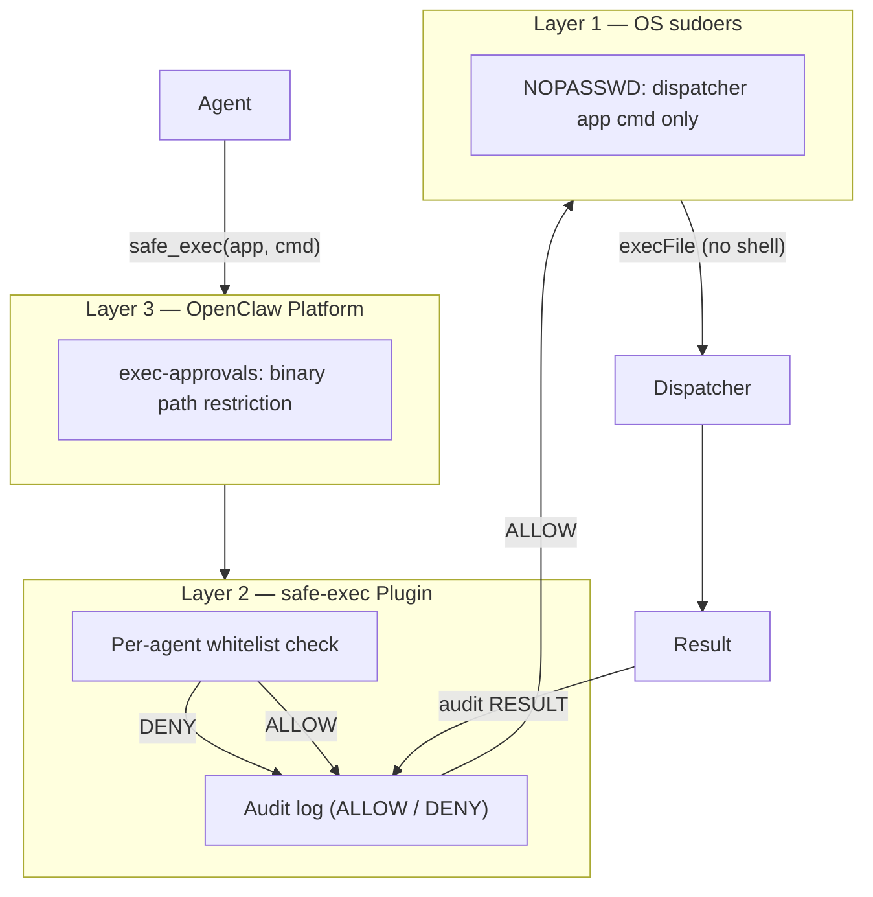

<div align="center">

# openclaw-safe-exec

**Per-agent whitelisted `sudo` execution with three-layer defense-in-depth**

Whitelist Isolation · Audit Trail · Zero Dependencies · sudoers Integration

[](https://github.com/yangsjt/openclaw-safe-exec/actions/workflows/ci.yml)
[]()
[](LICENSE)
[]()
[]()

</div>

## Why This Plugin?

AI Agents that manage macOS infrastructure need `sudo` for tasks like restarting services or applying configuration changes. Unrestricted root access is unacceptable. This plugin gives each agent exactly the privileges it needs — no more, no less — with every action recorded in an audit trail.

| Capability | OpenClaw Built-in (`exec-approvals`) | **+ safe-exec Plugin** |
|---|---|---|
| Binary path restriction | ✅ | ✅ |
| Per-agent command isolation | ❌ | ✅ |
| App:command whitelist | ❌ | ✅ |
| Wildcard patterns (`app:*`) | ❌ | ✅ |
| Audit trail (ALLOW/DENY/RESULT) | ❌ | ✅ |
| Dynamic agent ID resolution | ❌ | ✅ |
| `sudo -n` non-interactive mode | ❌ | ✅ |
| `execFile` (no shell injection) | ❌ | ✅ |
| Execution timeout (30s) | ❌ | ✅ |
| Per-agent tool description | ❌ | ✅ |
| Unconfigured agents blocked | ❌ | ✅ |

## Architecture

Three independent layers — compromising one does not bypass the others.



## Per-Agent Permission Isolation

| Agent | Role | Allowed | Denied |
|-------|------|---------|--------|
| **david** | Infrastructure ops | `webserver:*`, `database:*`, `monitoring:status`, `backup:status`, `backup:list` | `backup:start/stop/restart`, `monitoring:*` |
| **bob** | Maintenance assistant | `backup:*`, `monitoring:*` | `webserver:*`, `database:*` |

david can restart the webserver and manage the database, but cannot run backups or view full monitoring. bob can manage backups and monitoring, but has zero access to core services. Each agent operates in its own permission sandbox.

## Audit Trail

Every call — allowed or denied — is appended to the audit log:

```
2026-03-08T16:30:00.000Z | david        | ALLOW  | webserver status
2026-03-08T16:30:01.000Z | david        | RESULT | webserver status | exit=0
2026-03-08T16:31:00.000Z | bob          | DENY   | database status
```

Fields: timestamp, agent ID, verdict (ALLOW/DENY/RESULT), command, exit code. Enables post-incident forensics and compliance review.

## Installation

1. **Install the plugin**

   ```bash
   npm install openclaw-safe-exec
   openclaw plugins install openclaw-safe-exec
   ```

   Or install from source:

   ```bash
   git clone https://github.com/yangsjt/openclaw-safe-exec.git
   cd openclaw-safe-exec
   openclaw plugins install .
   ```

2. **Install sudoers rules** (grants NOPASSWD for `tools.sh` only)

   ```bash
   bash sudoers/install-sudoers.sh
   ```

3. **Add plugin config to `~/.openclaw/openclaw.json`**

   Copy [`examples/openclaw.json.example`](examples/openclaw.json.example) and customize:

   - `dispatcher` — absolute path to your dispatcher script
   - `sudoApps` — apps that require `sudo` to execute
   - `agents` — per-agent allow lists (see Whitelist Format below)

4. **Restart OpenClaw gateway**

## Configuration

```jsonc
{
  "plugins": {
    "entries": {
      "safe-exec": {
        "enabled": true,
        "config": {
          "dispatcher": "/path/to/your/dispatcher.sh",
          "sudoApps": ["webserver", "database"],
          "auditLog": "~/.openclaw/safe-exec-audit.log",
          "agents": {
            "david": {
              "allow": [
                "webserver:*",
                "database:*",
                "monitoring:status",
                "backup:status",
                "backup:list"
              ]
            },
            "bob": {
              "allow": [
                "backup:*",
                "monitoring:*"
              ]
            }
          }
        }
      }
    }
  }
}
```

## Whitelist Format

- `app:cmd` — exact match (e.g. `monitoring:status`)
- `app:*` — all commands for that app (e.g. `webserver:*`)

## Tests

```bash
npm test
```

## Files

| File | Purpose |
|------|---------|
| `index.js` | Plugin entry: `register(api)` |
| `src/safe-exec-tool.js` | Tool factory with per-agent permission |
| `src/permission.js` | Whitelist parsing and matching |
| `src/executor.js` | `child_process.execFile` wrapper with sudo |
| `src/audit.js` | Append-only audit log |
| `sudoers/openclaw-agents.sudoers.example` | NOPASSWD rules template |
| `sudoers/install-sudoers.sh` | Safe sudoers installer |
| `examples/openclaw.json.example` | Sanitized config template |
| `examples/local.json` | Local machine config (gitignored) |
| `openclaw.plugin.json` | Plugin manifest (id: `safe-exec`) |

## License

[MIT](LICENSE)
